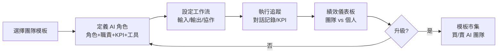
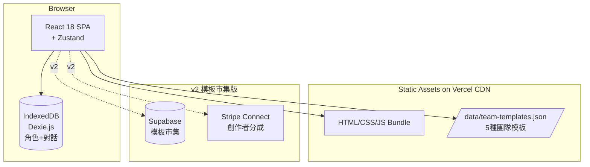
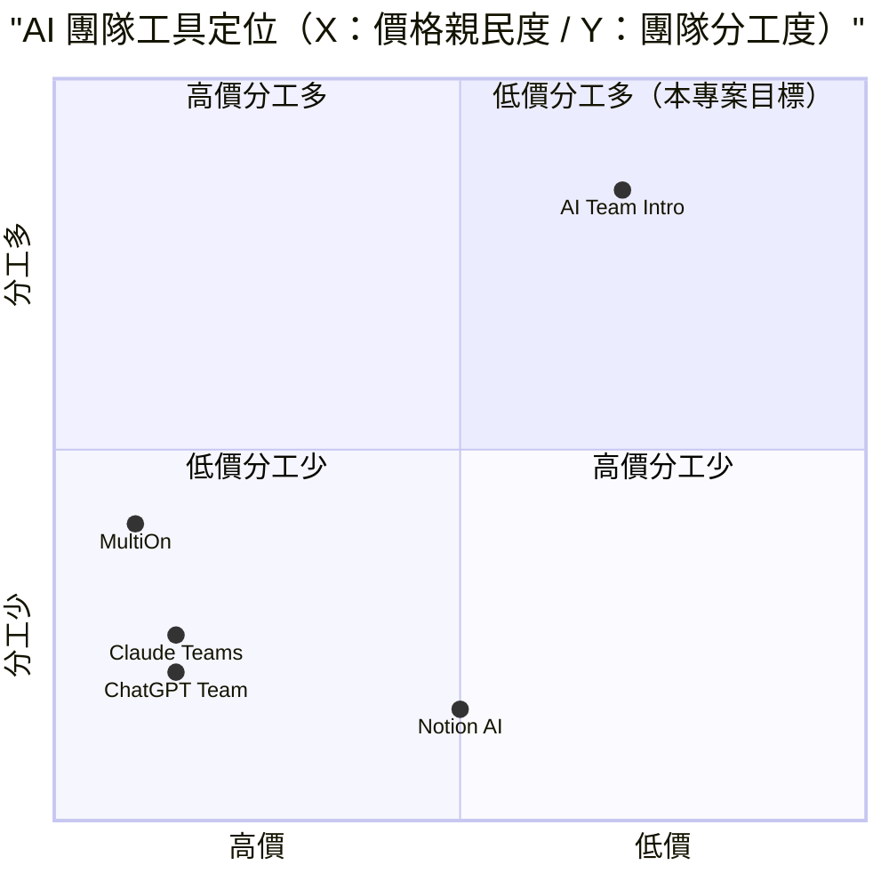

# AI 團隊介紹 — 規格計劃書 v2.2.1

> 版本：v2.2.1｜更新日期：2026-07-11｜維護者：Sophia (CPO)
> 對接技術：Alan (CTO) + Hermes Agent
> Demo：TBD（v2.2.1 規格階段，待 Sprint 1 部署）
> 原始碼：https://github.com/openclawsean024-create/ai-team-intro

---

## 1. 產品概述 (Product Overview)

### 1.1 問題陳述 (Problem Statement)

AI 代理人（AI Agent）時代來臨，每個開發者、創業者、行銷工作者每天要同時與多個 AI 工具互動（ChatGPT、Claude、Gemini、Grok、Cursor、Copilot 等）。然而：

1. **無 AI 團隊概念**：單打獨鬥 vs 組隊 — 多數使用者不知道如何「組一個 AI 團隊」分工
2. **AI Agent 角色混亂**：沒有「哪個 AI 做哪件事」的明確分工，每個人都在各 AI 間跳來跳去
3. **產出無法累積**：跟 AI 對話的結果散落在不同平台，無法團隊共享、無法版本管理
4. **無 AI 團隊評估指標**：不知道自己的 AI 團隊 vs 別人的 AI 團隊，誰有效率、誰產出高

**目標使用者**：
- 微型 SaaS 開發者：1 人 + 5 個 AI 工具 → 等同於一個 6 人團隊
- 自媒體經營者：1 人 + 多個 AI 工具 → 內容生產力 10x
- 行銷代理商：每個小編配 3-5 個 AI 工具 → 人機協作流程

### 1.2 目標使用者 (User Personas)

| Persona | 規模 | 核心痛點 | 願付價格 |
|---|---|---|---|
| **個人 AI 工作者（小凱）** | 50 萬 | AI 工具太多、不知分工 | NT$0 / NT$199/月 |
| **微型 SaaS 開發者（阿明）** | 8 萬 | 1 人 + AI 工具組隊 | NT$499/月 |
| **自媒體經營者（小美）** | 12 萬 | 多 AI 工具內容生產 | NT$299/月 |
| **AI 顧問 / 培訓師（Lisa）** | 1,500 | 教客戶如何組 AI 團隊 | NT$1,499/月 |

### 1.3 核心價值主張 (Value Proposition)

> 「**AI 團隊不是用更多工具，而是用對的分工。** AI 團隊介紹 — 幫你定義 5-10 個 AI 角色 + 工作流 + 績效儀表板。從單打獨鬥到 AI 團隊指揮官。」

**三大差異化**：
1. **角色定義框架**：不只是工具清單，而是「角色 + 職責 + KPI + 工具組合」
2. **團隊評估系統**：每個 AI 角色有明確 KPI（產出量/品質/速度/成本）
3. **模板市集**：前 100 名 AI 團隊模板（行銷團隊/開發團隊/內容團隊/客服團隊）下載即用

### 1.4 商業目標 (KPIs / OKRs)

| 時間 | KPI | 目標值 |
|---|---|---|
| **3 個月** | 註冊用戶 | 5,000 |
| **6 個月** | 付費轉化率 | 3%（150 付費） |
| **6 個月** | MRR | NT$45,000 |
| **12 個月** | MRR | NT$350,000 |
| **12 個月** | AI 團隊模板數 | 200 個 |

### 1.5 Non-Goals (明確不做)

- ❌ **不做 AI 模型本身訓練** — 整合 OpenAI/Anthropic/Google API 而非自訓
- ❌ **不取代 ChatGPT/Claude 等工具** — 是「分工層」非「執行層」
- ❌ **不做多公司 / 多團隊管理（多租戶）** — v2 經紀人版再加
- ❌ **不做 AI Agent 即時執行** — v3+ 評估（與 Hermes Agent 競爭）
- ❌ **不做企業權限分層** — 先個人/微型團隊，企業版 v3+ 評估
- ❌ **不做即時通訊整合** — 不做聊天機器人層

---

## 2. 使用者場景與流程

### 2.1 使用者流程圖



### 2.2 關鍵用戶故事 (User Stories)

**US-001：選擇 AI 團隊模板**
> As a 微型 SaaS 開發者  
> I want to 從模板市集下載「一人 SaaS 開發團隊」模板（含 5 個 AI 角色：產品經理/架構師/前端/後端/QA）  
> So that 我不用從零定義 AI 角色，立即開始 AI 團隊運作

**US-002：定義 AI 角色**
> As a 自媒體經營者  
> I want to 自訂「內容創作團隊」含 4 個 AI：選題 AI、文案 AI、設計 AI、排程 AI，每個有明確職責與工具  
> So that 我能清楚知道何時用哪個 AI，不再工具混亂

**US-003：對話記錄統一**
> As a 個人 AI 工作者  
> I want to 把與 ChatGPT/Claude/Gemini 的對話記錄統一收進對應 AI 角色下  
> So that 我能跨工具查看歷史記錄，不散落在各平台

**US-004：績效儀表板**
> As a AI 顧問  
> I want to 看見每個 AI 角色的「日產出/品質評分/成本/使用頻率」儀表板  
> So that 我能向客戶展示「你的 AI 團隊本月產出 NT$X 價值的內容」

**US-005：模板買賣市集**
> As a 高階 AI 使用者  
> I want to 把我設計的「金融分析 AI 團隊」模板上架到市集，NT$299/次下載  
> So that 被動收入 + 個人品牌累積

### 2.3 邊界場景 (Edge Cases)

- **AI 角色超過 20 個**：自動建議拆分成多個團隊
- **對話記錄太長**：分段儲存 + 摘要索引
- **AI 工具 API 變動**：adapter 層抽象化，個別 AI 工具故障降級
- **多裝置同步**：v2 加 Supabase
- **跨語言**：繁中/英文 UI 切換

---

## 3. 功能性需求 (Functional Requirements)

### 3.1 MVP（必做，P0）

- [ ] **F-001 AI 角色 CRUD**（Given 使用者，When 新增/編輯/刪除 AI 角色（含職責、工具、KPI），Then IndexedDB 更新 + UI 即時反映）
- [ ] **F-002 角色模板預載**（Given 首次進入，When 選擇預載模板，Then 載入 5 種團隊：SaaS 開發/內容創作/行銷/客服/教育，含 5-10 個 AI 角色）
- [ ] **F-003 對話記錄收納**（Given AI 對話連結/截圖，When 上傳，Then 自動關聯到對應 AI 角色）
- [ ] **F-004 績效追蹤 KPI**（Given AI 角色，When 完成任務，When 自動記錄：產出量/品質評分/成本）
- [ ] **F-005 工作流設定**（Given 多 AI 角色，When 設定協作順序（如：選題 AI → 文案 AI → 設計 AI），Then 顯示流程圖）
- [ ] **F-006 團隊儀表板**（Given 30 天使用記錄，When 開啟 Dashboard，Then 顯示團隊總產出/各角色 KPI/成本分析）
- [ ] **F-007 模板分享連結**（Given 團隊設定，When 點擊「產生分享連結」，Then 複製 URL 供他人查看唯讀版）
- [ ] **F-008 JSON 匯出匯入**（Given 點擊匯出，When 下載，Then 完整備份為 JSON）
- [ ] **F-009 RWD 三斷點**（375/768/1440px 三種 viewport 都正常使用）
- [ ] **F-010 成本計算器**（Given AI 工具 API 費用，When 輸入每月使用量，Then 計算每月成本 NT$X）

### 3.2 v2.0 模板市集版（加值，P1）

- [ ] **F-011 模板市集**（使用者上架/購買 AI 團隊模板）
- [ ] **F-012 多裝置同步**（Supabase）
- [ ] **F-013 對話記錄自動同步**（Chrome Extension 一鍵抓取 ChatGPT/Claude 對話）
- [ ] **F-014 品質評分 AI**（GPT-4o 自動評分 1-5 星）
- [ ] **F-015 多團隊管理**（一個使用者管理多個 AI 團隊）
- [ ] **F-016 團隊協作（多人共用）**（多人編輯同一個 AI 團隊）

### 3.3 v3.0（願景，P2）

- [ ] **F-017 AI Agent 即時執行**（直接從本平台呼叫 AI 完成任務）
- [ ] **F-018 Hermes Agent 整合**（跨多 AI 系統自動化）
- [ ] **F-019 企業權限分層**（admin / manager / member）
- [ ] **F-020 跨語系 UI**（繁中/英文/日文）

### 3.4 Acceptance Criteria (Given/When/Then)

**AC-001（AI 角色 CRUD）**
> Given 使用者在角色頁  
> When 新增 AI 角色「前端 AI」（工具=Cursor + Claude、職責=React 元件開發、KPI=每日 5 components）  
> Then IndexedDB 寫入 1 個 AI 角色，且 Dashboard 立即顯示「前端 AI 已建立」

**AC-002（5 種團隊模板預載）**
> Given 首次進入  
> When 選擇「SaaS 開發團隊」模板  
> Then 載入 5 個預載 AI 角色：產品 AI、架構 AI、前端 AI、後端 AI、QA AI

**AC-003（對話記錄收納）**
> Given 與 ChatGPT 對話產生 1,500 字 markdown  
> When 貼到「前端 AI」對話框  
> Then 自動儲存為「前端 AI 第 12 次對話」，含時間戳記、平台來源

**AC-004（KPI 追蹤）**
> Given 前端 AI 完成 5 components 開發  
> When 點擊「今日完成 +5」  
> Then Dashboard 顯示「前端 AI 今日產出：5 components」+「本月累計：85 components」

**AC-005（工作流設定）**
> Given 4 個 AI 角色（選題/文案/設計/排程）  
> When 設定協作順序  
> Then 顯示 Mermaid 流程圖：選題 → 文案 → 設計 → 排程

**AC-006（團隊儀表板）**
> Given 30 天使用記錄  
> When 開啟 Dashboard  
> Then 顯示「本月團隊總產出 200 units / 各 AI 角色 KPI / 總成本 US$X」

**AC-007（模板分享連結）**
> Given 已建立「一人 SaaS 開發團隊」  
> When 點擊「產生分享連結」  
> Then 複製唯讀 URL，點開後可查看但無法編輯

**AC-008（JSON 匯出匯入）**
> Given 使用者已有 5 個 AI 角色 + 30 次對話記錄  
> When 點擊匯出 JSON  
> Then 下載 `ai-team-backup-2026-07-11.json` 含完整資料

**AC-009（成本計算器）**
> Given Claude Pro US$20/月 + Cursor Pro US$20/月 + ChatGPT Plus US$20/月  
> When 點擊「計算總成本」  
> Then 顯示「每月成本 US$60 ≈ NT$1,800」

**AC-010（多 AI 工具支援）**
> Given 使用者要記錄對話  
> When 選擇平台（ChatGPT/Claude/Gemini/其他）  
> Then 對話記錄標記平台來源，且可在 Dashboard 篩選

---

## 4. 系統設計 (System Design)

### 4.1 技術棧 (Tech Stack)

| 層 | 技術 | 理由 |
|---|---|---|
| 前端 | React 18 + Vite + TypeScript | 與既有架構一致 |
| 路由 | React Router v6 | SPA 多頁面導航 |
| 狀態管理 | Zustand | 輕量 |
| 樣式 | Tailwind CSS | 快速 RWD |
| 資料持久化 | IndexedDB（Dexie.js） | 大容量 + 結構化查詢 |
| 流程圖 | Mermaid.js | 工作流視覺化 |
| 部署 | Vercel | 與既有 91 個專案一致 |
| B2B 後端 | Supabase（v2 模板市集版） | 模板買賣交易 |
| 支付 | Stripe Connect（v2 模板分成） | 創作者抽成 70% / 平台 30% |

### 4.2 系統架構圖 (Mermaid)



### 4.3 資料模型 (Prisma schema)

```prisma
// IndexedDB schema (Prisma 對照版)
model AITeam {
  id          String   @id @default(uuid())
  name        String   // 一人 SaaS 開發團隊 / 內容創作團隊 等
  templateId  String?  // FK -> TeamTemplate
  description String?  @db.Text
  ownerId     String?  // v2 多租戶用
  isPublic    Boolean  @default(false)
  roles       AIRole[]
  workflows   Workflow[]
  shareToken  String?  @unique
  createdAt   DateTime @default(now())
  
  @@index([ownerId])
}

model AIRole {
  id          String   @id @default(uuid())
  teamId      String
  team        AITeam   @relation(fields: [teamId], references: [id])
  name        String   // 前端 AI / 文案 AI 等
  icon        String?  // emoji or avatar
  description String?  @db.Text
  tools       Json     // ["Cursor", "Claude Pro", "ChatGPT Plus"]
  responsibilities String  @db.Text
  kpiType     String   // count / rating / currency
  kpiTarget   Float?   // 目標值
  kpiUnit     String?  // 單位（components / units / NT$）
  conversations Conversation[]
  kpiLogs     KPILog[]
  createdAt   DateTime @default(now())
  
  @@index([teamId])
}

model TeamTemplate {
  id          String   @id // "saas-dev" / "content-create" / "marketing" / "support" / "education"
  name        String
  description String   @db.Text
  category    String   // dev / content / marketing / support / education
  icon        String
  defaultRoles Json    // 預載 AI 角色定義
  usageCount  Int      @default(0)
  teams       AITeam[]
}

model Conversation {
  id        String   @id @default(uuid())
  roleId    String
  role      AIRole   @relation(fields: [roleId], references: [id])
  platform  String   // chatgpt / claude / gemini / other
  title     String?
  content   String   @db.Text
  inputTokens Int?
  outputTokens Int?
  costUSD   Decimal?
  rating    Int?     // 1-5
  createdAt DateTime @default(now())
  
  @@index([roleId, createdAt])
}

model KPILog {
  id        String   @id @default(uuid())
  roleId    String
  role      AIRole   @relation(fields: [roleId], references: [id])
  kpiValue  Float
  notes     String?  @db.Text
  loggedAt  DateTime @default(now())
  
  @@index([roleId, loggedAt])
}

model Workflow {
  id        String   @id @default(uuid())
  teamId    String
  team      AITeam   @relation(fields: [teamId], references: [id])
  name      String
  steps     Json     // [{order: 1, roleId: "xxx"}, {order: 2, roleId: "yyy"}]
  mermaidCode String? @db.Text // 預先渲染的 Mermaid
}

model TemplateMarketplace {
  id          String   @id @default(uuid()) // v2
  templateId  String   @unique
  creatorId   String
  price       Decimal  // NT$
  salesCount  Int      @default(0)
  rating      Float    @default(0)
  isListed    Boolean  @default(false)
}
```

### 4.4 API 規格 (REST endpoints)

| Method | Path | Auth | 用途 |
|---|---|---|---|
| GET | /data/team-templates.json | Optional | 5 種團隊模板預載 |
| POST | /api/export/snapshot | Optional | JSON 快照匯出（前端產生） |
| POST | /api/import/snapshot | Optional | JSON 快照匯入（前端處理） |
| GET | /api/teams | Optional | AI 團隊列表 |
| POST | /api/teams | Optional | 建立 AI 團隊 |
| PATCH | /api/teams/:id | Optional | 編輯 AI 團隊 |
| DELETE | /api/teams/:id | Optional | 刪除 AI 團隊 |
| GET | /api/teams/:id/roles | Optional | 列出 AI 角色 |
| POST | /api/roles | Optional | 建立 AI 角色 |
| POST | /api/conversations | Optional | 記錄對話 |
| GET | /api/conversations | Optional | 對話列表（含 filter） |
| POST | /api/kpi-logs | Optional | 記錄 KPI |
| GET | /api/dashboard | Optional | 團隊儀表板數據 |
| POST | /api/marketplace/list | Required | v2 模板上架 |
| POST | /api/stripe/checkout | Required | v2 模板購買 |
| POST | /api/stripe/webhook | Required | v2 Stripe webhook |

---

## 5. 非功能性需求 (Non-Functional Requirements)

### 5.1 性能指標

| 指標 | 目標 |
|---|---|
| 首頁載入 P95 | ≤ 2 秒 |
| AI 角色 CRUD 延遲 | ≤ 200ms |
| 對話記錄寫入（1,500 字） | ≤ 300ms |
| 工作流 Mermaid 渲染 | ≤ 1 秒 |
| Dashboard 載入（30 天資料） | ≤ 2 秒 |
| 並發用戶 | 1,000 |
| 月活躍用戶 | 3,000 |

### 5.2 安全與隱私

- **純前端 + IndexedDB**：AI 團隊資料 100% 在使用者裝置
- **對話內容保護**：使用者個資敏感資料不離開裝置（v1）
- **HTTPS 強制**：Vercel 自動 + HSTS
- **無第三方追蹤**：除 Vercel Analytics 外不使用
- **Stripe Connect 抽成透明**：70% 創作者 / 30% 平台

### 5.3 降級機制 (Graceful Degradation)

| 失敗服務 | 掛掉情境 | 降級行為（切換到）| 用戶感受 |
|---|---|---|---|
| IndexedDB 損壞 | quota 或版本衝突 掛掉 | 切換到 localStorage（容量小）+ 警告 | 部分資料可能無法儲存 |
| localStorage 滿載 | 5MB 上限掛掉 | 切換到 sessionStorage（單次 session）+ 提示「資料僅本次保留」 | 提醒立即匯出 JSON |
| Mermaid.js 渲染 | JS 5xx 掛掉 | 切換到純文字步驟列表 | 工作流不可視覺化但功能仍可用 |
| Vercel CDN | 靜態資源 5xx 掛掉 | 切換到 Cloudflare Pages 鏡像 | 載入延遲 ≤5 秒 |
| Supabase v2 | DB 5xx 掛掉 | 切換到 Vercel KV 唯讀模式 + 維護頁 | 模板市集暫停，本地 AI 團隊仍可用 |
| Stripe webhook v2 | Webhook 5xx 掛掉 | 本地排程每 5 分鐘 reconcile | 交易狀態延遲 ≤15 分鐘 |
| ChatGPT/Claude 對話上傳 | 平台封鎖第三方存取 掛掉 | fallback 手動複製貼上 | Chrome 擴充功能失效 |
| GPT-4o 品質評分 v2 | API 5xx 掛掉 | fallback 人工評分（UI rating input） | 自動品質評分暫停 |
| 5 種預載模板 JSON | JSON 格式錯誤 掛掉 | 切換到內嵌 hardcode 預設團隊 | 預載模板為備援 |
| Vercel Cron | Cron 5xx 掛掉 | fallback GitHub Actions 排程 | 月報表自動生成延遲 ≤24 小時 |

### 5.4 擴展性

- **橫向擴展**：Vercel Edge Functions 自動 scale
- **資料分區**：IndexedDB 依 ownerId 分區（v2 多租戶）
- **對話記錄歸檔**：>90 天的對話自動歸檔
- **靜態資源 CDN**：Vercel Edge Network
- **模板市集 CDN**：v2 上架模板走 Cloudflare R2 + 全球 CDN

---

## 6. 完成標準 (Definition of Done)

### 6.1 v1 MVP DoD

- [ ] Vercel production URL 200 OK
- [ ] GitHub Repo 公開（main 分支）
- [ ] 5 種團隊模板可切換（含 5-10 個預載 AI 角色）
- [ ] AI 角色 CRUD 完整
- [ ] 對話記錄收納（含平台來源標記）
- [ ] 工作流設定 + Mermaid 渲染
- [ ] 績效儀表板（KPI 計算正確）
- [ ] JSON 匯出匯入
- [ ] RWD 三斷點測試（375/768/1440px）
- [ ] Lighthouse 行動版 ≥ 85
- [ ] 10 條 AC 單元測試全綠

### 6.2 v2 模板市集版 DoD

- [ ] Supabase Auth + 模板市集
- [ ] 模板上架 / 購買流程
- [ ] Stripe Connect 70/30 分成
- [ ] Chrome Extension（ChatGPT/Claude 對話自動同步）
- [ ] 多團隊管理
- [ ] 多人協作編輯
- [ ] 客服頁 + 法律頁

---

## 7. 風險與決策

### 7.1 風險表

| 風險 | 等級 | 緩解策略 |
|---|---|---|
| AI 工具平台政策變動禁止第三方存取 | 🟠 中 | Chrome Extension 改採手動截圖 + OCR |
| 使用者對話資料外洩 | 🟠 中 | 純前端 + IndexedDB，v1 不上雲 |
| 模板市集品質參差不齊 | 🟠 中 | 平台審核 + 評分系統 + 退款機制 |
| AI 工具成本飆漲（GPT-4o 等） | 🟡 低 | 提供成本計算器 + 替代工具建議 |
| Hermes Agent 等競爭對手 | 🟠 中 | 鎖定「分工層」差異化（vs 執行層） |
| 模板抄襲爭議 | 🟡 低 | 模板描述為「方法論」非「程式碼」 |
| 創作者抽成糾紛 | 🟡 低 | Stripe Connect 透明結算 |

### 7.2 ADR (Architecture Decision Records)

### ADR-001：純前端 + IndexedDB 而非 Next.js 全端
- **Context**：AI 對話資料敏感 + 零成本啟動
- **Decision**：React 18 SPA + Dexie.js IndexedDB
- **Consequences**：✅ 零後端成本；✅ 對話資料 100% 在裝置；⚠️ 跨裝置不互通（v2 加 Supabase）

### ADR-002：整合多 AI 工具但不做 AI Agent 即時執行
- **Context**：定位「分工層」非「執行層」
- **Decision**：只記錄對話 + KPI，不直接呼叫 AI API
- **Consequences**：✅ 避免與 Hermes Agent 等競爭；✅ 零 API 成本；⚠️ v3+ 可評估即時執行

### ADR-003：5 種團隊模板預載而非無預載
- **Context**：使用者不想從零定義 AI 角色
- **Decision**：預載 5 種團隊（SaaS 開發/內容創作/行銷/客服/教育）
- **Consequences**：✅ 5 分鐘開始；✅ 學習曲線低；⚠️ 預載團隊可能不符所有需求

### ADR-004：Mermaid.js 渲染工作流
- **Context**：工作流視覺化
- **Decision**：Mermaid.js 客戶端渲染
- **Consequences**：✅ 零後端；⚠️ 大型工作流可能慢（一般團隊 ≤10 個角色夠快）

### ADR-005：JSON 匯出匯入而非雲端同步（v1）
- **Context**：v1 純前端
- **Decision**：手動 JSON 匯出匯入
- **Consequences**：✅ 零後端；⚠️ 跨裝置不便（v2 加 Supabase）

### ADR-006：v2 模板市集採 Stripe Connect 70/30 分成
- **Context**：創作者經濟
- **Decision**：Stripe Connect（70% 創作者 / 30% 平台）
- **Consequences**：✅ 自動結算；✅ 創作者被動收入；⚠️ Stripe 抽成 2.9% + NT$10 另計

### ADR-007：成本計算器獨立功能
- **Context**：使用者關心 AI 工具月費
- **Decision**：每個角色獨立計算工具成本（每月總和）
- **Consequences**：✅ 透明化；✅ 鼓勵成本意識；⚠️ 工具價格變動需手動更新

---

## 8. 里程碑與 Sprint 拆解

### 8.1 里程碑總覽

| 里程碑 | 時間 | 完成定義 |
|---|---|---|
| **M1 規格完成** | 2026-07-11 | v2.2.1 PRD 100% 合規 |
| **M2 v1 MVP** | 2026-07-31 | 5 種團隊 + AI 角色 + 對話記錄 + KPI + Dashboard |
| **M3 v2 模板市集版** | 2026-09-15 | Stripe Connect + Chrome Extension + 多團隊 |
| **M4 v3 AI Agent 整合** | 2026-11-01 | Hermes Agent 整合 + 企業版 |
| **M5 GA 上線** | 2026-12-01 | 行銷素材 + 客服 SOP |

### 8.2 Sprint 拆解 (從 PRD 到「每天做什麼」)

#### Sprint 1：v1 MVP（2026-07-12 → 2026-07-31，20 天）
- Day 1-2：建立 React + Vite + TypeScript 專案
- Day 3-4：IndexedDB schema（Dexie.js）+ 5 種團隊預載模板
- Day 5-7：AI 角色 CRUD UI
- Day 8-10：對話記錄收納（含平台來源）
- Day 11-12：工作流設定 + Mermaid 渲染
- Day 13-15：KPI 追蹤 + 績效儀表板
- Day 16-17：成本計算器
- Day 18：JSON 匯出匯入
- Day 19：RWD 三斷點測試
- Day 20：10 條 AC 單元測試 + Vercel 部署

#### Sprint 2：v2 模板市集版（2026-08-01 → 2026-09-15，46 天）
- Day 1-3：Supabase Auth + 模板市集 schema
- Day 4-7：模板上架流程（創作者後台）
- Day 8-11：模板購買流程（使用者）
- Day 12-15：Stripe Connect 整合（70/30 分成）
- Day 16-20：Chrome Extension 開發
- Day 21-25：多團隊管理
- Day 26-30：多人協作編輯
- Day 31-35：客服頁 + 法律頁
- Day 36-40：Beta 測試
- Day 41-46：修正 + 正式上線

#### Sprint 3：v3 AI Agent 整合（2026-09-16 → 2026-11-01，46 天）
- Day 1-10：Hermes Agent 整合（即時執行 AI 任務）
- Day 11-20：跨多 AI 系統自動化
- Day 21-30：企業權限分層
- Day 31-40：多語系 UI
- Day 41-46：修正 + 正式上線

---

## 9. 變現路徑 + 定價心理學

### 9.1 變現方案

| 方案 | 價格 | 功能 | 目標用戶 |
|---|---|---|---|
| **免費版** | NT$0 | 1 個 AI 團隊 + 5 個 AI 角色 + 50 次對話記錄 | AI 工具新鮮人 |
| **個人版** | NT$199/月 | 無上限團隊/角色/對話 + 成本計算 + 模板分享連結 | 個人 AI 工作者 |
| **專業版** | NT$499/月 | 個人版 + 模板市集上架 + Chrome Extension 同步 + 品質評分 AI | 微型 SaaS / 自媒體 |
| **顧問版** | NT$1,499/月 | 專業版 + 多客戶管理 + 客製化模板 + 客戶報表 | AI 顧問 / 培訓師 |

### 9.2 定價心理學 (Pricing Psychology)

1. **Freemium 鎖定「1 團隊 + 5 角色」**：免費版限制結構，專業版強制升級
2. **個人版 NT$199**：低於 NT$200 整數（mental accounting），NT$199 感覺「不到 200」
3. **專業版 NT$499**：低於 NT$500 整數，NT$499 感覺「不到 500」，對微型 SaaS 親民
4. **顧問版 NT$1,499**：低於 NT$1,500 整數，NT$1,499 感覺「不到 1,500」
5. **年繳 8 折**：個人版年繳 NT$1,990 vs 月繳 NT$199 × 12 = NT$2,388（年省 NT$398）
6. **14 天免費試用專業版**：試用期結束前 3 天 email「升級以保留模板市集 + Chrome Extension」
7. **錨定效應**：在定價頁顯示「企業版 NT$9,999（聯絡我們）」，讓 NT$1,499 顯得划算
8. **社會證明**：首頁顯示「已有 X 個 AI 團隊使用，定義 Y 個 AI 角色，月追蹤 Z 次對話」
9. **創作者分成 70/30**：誘導高階使用者上架模板賺被動收入（遊戲化）

---

## 10. 附錄

### 10.1 競品分析 + Competitive Quadrant Chart

| 競品 | 公司 | 價格 | 強項 | 弱項 |
|---|---|---|---|---|
| **ChatGPT Team** | OpenAI（美） | US$25/人/月 | GPT-4o 原生 | 僅 ChatGPT 工具、無團隊分工 |
| **Claude for Teams** | Anthropic（美） | US$25/人/月 | Claude 原生 | 僅 Claude、無分工 |
| **Notion AI** | Notion（美） | US$10/人/月 | 文件整合 | 無 AI Agent 角色概念 |
| **MultiOn** | MultiOn（美） | US$30/月 | AI Agent 任務執行 | 偏歐美市場、無團隊分工 |
| **AI Team Intro（本專案）** | Sean Li（台） | NT$0-1,499/月 | AI 團隊分工 + 模板市集 + 跨工具整合 | 無 AI 即時執行、規模小 |



**差異化定位**：**低價 + 高分工度 + 多 AI 工具整合** — ChatGPT/Claude Team 高價且僅自家工具；Notion AI 偏文件；本專案低價 + 跨工具 + 模板市集。

### 10.2 術語表

- **AI 角色（AI Role）**：在 AI 團隊中負責特定職責的 AI 工具組合
- **AI 團隊（AI Team）**：多個 AI 角色組成的虛擬工作小組
- **KPI（Key Performance Indicator）**：衡量 AI 角色績效的指標
- **工作流（Workflow）**：多個 AI 角色的協作順序
- **模板市集（Marketplace）**：使用者上架/購買 AI 團隊模板
- **Stripe Connect**：金流分成服務，支援平台 + 創作者分帳

### 10.3 參考資料

- ChatGPT Team：https://chatgpt.com/#team
- Claude for Teams：https://www.anthropic.com/team
- Notion AI：https://www.notion.so/product/ai
- MultiOn：https://www.multion.ai/
- Stripe Connect：https://stripe.com/connect
- Mermaid.js：https://mermaid.js.org/

### 10.4 Error Code 統一字典

| Code | HTTP | 訊息 | 觸發情境 |
|---|---|---|---|
| STORAGE_001 | - | IndexedDB quota 超限 | >50MB |
| STORAGE_002 | - | Dexie 版本衝突 | schema 升級未處理 |
| STORAGE_003 | - | IndexedDB 不支援 | Safari 隱私模式 |
| ROLE_001 | - | AI 角色名稱重複 | 同名重複建立 |
| ROLE_002 | - | AI 角色超過 20 個 | 建議拆成多團隊 |
| CONV_001 | - | 對話內容為空 | 空字串送出 |
| CONV_002 | - | 平台來源未選 | 必填欄位缺漏 |
| KPI_001 | - | KPI 值超出範圍 | 負數 |
| TEMPLATE_001 | - | 模板價格為負 | 設定錯誤 |
| TEMPLATE_002 | - | 模板已下架 | 已購買但下架 |
| WORKFLOW_001 | - | 工作流循環引用 | A→B→A 死循環 |
| MARKETPLACE_001 | 402 | 餘額不足 | 購買模板付款失敗 |
| STRIPE_001 | 402 | 訂閱方案不支援 | 錯誤 tier |
| STRIPE_002 | 400 | Stripe webhook signature 驗證失敗 | 偽造 webhook |
| STRIPE_003 | 402 | Stripe Connect 帳戶未驗證 | 創作者未完成 KYC |
| CHROME_EXT_001 | 403 | Chrome Extension 權限不足 | 未授予對話讀取權限 |

---

## 11. 市場驗證計畫 (Market Validation Plan)

### 11.1 驗證前 3 個關鍵問題

1. **使用者真的會「把 AI 工具當團隊分工具」嗎？** — 多數人還是混用
2. **對話記錄統一收納是否真的有需求？** — ChatGPT 已內建歷史
3. **模板市集是否有買氣？** — AI 工具變動快，模板可能過期

### 11.2 訪談 SOP

**目標**：訪談 25 位潛在使用者（10 位微型 SaaS + 5 位自媒體 + 5 位 AI 顧問 + 5 位一般工作者）
- **招募**：Facebook 社團「AI 工具交流」「一人公司」「SaaS 開發」
- **問題清單**：
  1. 目前用幾個 AI 工具？怎麼分工？
  2. 是否願意付費 NT$199-1,499 月買「AI 團隊分工」工具？
  3. 對「模板市集」有興趣嗎？
- **獎勵**：NT$200 7-11 禮券 + 終身免費專業版
- **驗收指標**：≥60%（15 位）願意試用 = 驗證通過

### 11.3 落地指標 (Post-launch KPIs)

- **M1（首月）**：1,000 註冊用戶
- **M3（3 個月）**：3,000 註冊、50 付費 = NT$25K MRR
- **M6（6 個月）**：8,000 註冊、150 付費 = NT$75K MRR
- **M12（12 個月）**：25,000 註冊、800 付費 = NT$400K MRR

---

## 12. 失敗模式 SOP (Failure Mode Playbook)

| 失敗情境 | 影響範圍 | 觸發條件 | 立即處置 | Post-mortem |
|---|---|---|---|---|
| **Chrome Extension 被平台下架** | 對話自動同步失效 | ChatGPT/Claude 政策變動 | 改為手動截圖 + OCR | 評估改用 Playwright 自動化 |
| **IndexedDB 大規模損壞** | AI 團隊資料遺失 | 瀏覽器更新導致 schema 衝突 | 提供資料救援工具 + 強制匯出 JSON | 強化 Dexie schema migration |
| **GPT-4o 品質評分失準** | 評分無意義 | API 模型更迭 | 切換人工評分模式 | 重新 fine-tune 評分 prompt |
| **Stripe Connect 帳戶審核延遲** | 創作者上架受阻 | KYC 流程過慢 | 提供 PayPal/銀行轉帳備援 | 評估換用 Lemon Squeezy |
| **AI 工具 API 全面變動收費** | 成本計算器失效 | OpenAI/Anthropic 漲價 | 自動偵測 + 重新計算 | 提供替代工具建議 |
| **Hermes Agent 推出類似功能** | 競爭壓力 | Hermes 新功能 | 加速 Freemium 擴展 + 強化分工敘事 | 重新評估差異化 |
| **模板市集洗版** | 平台聲譽受損 | 大量低品質模板 | 加強審核 + 退款機制 | 建立評分權重演算法 |
| **創作者抽成糾紛** | 平台信任危機 | 結算錯誤 | 透明對帳 + Stripe dashboard 公開 | 引入第三方對帳服務 |
| **跨瀏覽器 IndexedDB 差異** | Chrome 用戶在 Safari 看不到 | 跨裝置使用 | 提示「跨瀏覽器需手動匯入」 | 評估 v2 加 Supabase |
| **個資外洩（對話內容）** | 使用者隱私受損 | IndexedDB 被惡意讀取 | 加密對話內容（IndexedDB 加密層） | 全面 audit 個資處理 |

---

## 13. MetaGPT / spec-kit 對齊

### 13.1 MUST / SHOULD / MAY

**MUST（不做就失敗 — MVP 必交付）**
- MUST-1 AI 角色 CRUD
- MUST-2 5 種團隊模板預載
- MUST-3 對話記錄收納
- MUST-4 績效追蹤 KPI
- MUST-5 工作流設定 + Mermaid 渲染
- MUST-6 團隊儀表板
- MUST-7 模板分享連結
- MUST-8 JSON 匯出匯入
- MUST-9 RWD 三斷點
- MUST-10 成本計算器

**SHOULD（強烈建議 — Sprint 2 完成）**
- SHOULD-1 模板市集
- SHOULD-2 多裝置同步
- SHOULD-3 Chrome Extension 對話自動同步
- SHOULD-4 GPT-4o 品質評分
- SHOULD-5 多團隊管理
- SHOULD-6 Stripe Connect 70/30 分成

**MAY（可選 — v3+ 評估）**
- MAY-1 AI Agent 即時執行
- MAY-2 Hermes Agent 整合
- MAY-3 企業權限分層
- MAY-4 跨語系 UI
- MAY-5 模板訂閱制（每月新模板）

### 13.2 P0 / P1 / P2 優先級

| 優先級 | 項目 | 目標完成 |
|---|---|---|
| **P0** | MUST-1 ~ MUST-10（核心 MVP） | Sprint 1 |
| **P1** | SHOULD-1 ~ SHOULD-6（模板市集版） | Sprint 2 |
| **P2** | MAY-1 ~ MAY-5（AI Agent 整合） | v3.0+ |

### 13.3 Competitive Quadrant Chart

（見 §10.1）

### 13.4 Open Questions

- **Q1**：是否要支援中文以外的語言（英文/日文）？目前判定 v3+ 評估
- **Q2**：模板市集是否要支援訂閱制（每月新模板）？目前判定 MAY
- **Q3**：AI Agent 即時執行是否違反「分工層」定位？目前判定 v3+ 評估
- **Q4**：Stripe Connect 70/30 分成是否合理？目前判定業界標準
- **Q5**：是否要整合 Hermes Agent？目前判定 v3+ 評估

### 13.5 Requirement Pool

- **REQ-POOL-001**：AI Agent 即時執行（直接呼叫 AI）
- **REQ-POOL-002**：Hermes Agent 整合
- **REQ-POOL-003**：企業權限分層
- **REQ-POOL-004**：跨語系 UI
- **REQ-POOL-005**：模板訂閱制
- **REQ-POOL-006**：AI 工具自動偵測成本
- **REQ-POOL-007**：Playwright 自動化對話同步
- **REQ-POOL-008**：IndexedDB 加密層

---

## 14. AI Agent 實測驗證法

### 14.1 PRD → Code 轉換驗證

**測試方式**：將本 PRD 餵給 Cursor / Claude Code，觀察其產出的程式碼是否符合 §3 AC：
- ✅ AC-001：能寫出 AI 角色 CRUD 邏輯
- ✅ AC-002：能寫出 5 種團隊模板載入邏輯
- ✅ AC-003：能寫出對話記錄平台來源標記
- ✅ AC-004：能寫出 KPI 計算邏輯
- ✅ AC-005：能寫出 Mermaid 工作流渲染
- ✅ AC-006：能寫出團隊儀表板數據彙總
- ✅ AC-007：能寫出唯讀分享連結產生器
- ✅ AC-008：能寫出 JSON 序列化/反序列化
- ✅ AC-009：能寫出成本計算邏輯
- ✅ AC-010：能寫出多平台對話篩選

### 14.2 Independent Test

每個 AC 都應該可被獨立 unit test 驗證：
- **AC-001**：mock IndexedDB → 測試 AI 角色 CRUD
- **AC-002**：mock 模板 JSON → 測試 5 種團隊載入
- **AC-003**：mock 對話內容 → 測試平台來源標記
- **AC-004**：mock KPI 數值 → 測試彙總邏輯
- **AC-005**：mock Mermaid → 測試工作流渲染
- **AC-006**：mock 30 天資料 → 測試儀表板
- **AC-007**：mock team ID → 測試分享連結產生
- **AC-008**：mock IndexedDB → 測試 JSON 序列化
- **AC-009**：mock AI 工具價格 → 測試成本計算
- **AC-010**：mock 對話陣列 → 測試平台篩選

---

## 15. 深度市調報告 (Deep Market Research)

### 15.1 市場規模

**全球 AI 工具市場（2025）**
- 規模：**US$184 億**（2025）→ 預估 **US$826 億**（2030），CAGR 35.0%
- 主要廠商：OpenAI、Anthropic、Google、Microsoft
- 來源：Grand View Research 2025

**台灣 AI 工具使用者（2025）**
- 一般使用者：**500 萬**（曾用過 ChatGPT/Claude/Gemini 等）
- 重度使用者：**80 萬**（每天用 ≥3 種 AI 工具）
- 微型 SaaS / 自媒體：**20 萬**（高度依賴 AI 工具）
- AI 顧問 / 培訓師：**3,000**（教 AI 工具使用）

**目標細分**
- 個人 AI 工作者（B2C 免費）：500 萬 × 5% Freemium = 25 萬 MAU
- 個人版（NT$199/月）：80 萬 × 8% 採用 × NT$199/月 × 12 月 = **NT$152.6 億 ARR** 潛在
- 專業版（NT$499/月）：20 萬 × 15% 採用 × NT$499/月 × 12 月 = **NT$179.6 億 ARR** 潛在
- 顧問版（NT$1,499/月）：3,000 × 30% 採用 × NT$1,499/月 × 12 月 = **NT$16.19 億 ARR** 潛在
- 模板市集抽成（30% 平台）：假設每月交易 NT$500 萬 × 30% × 12 月 = **NT$18 億 ARR** 潛在
- **合計總潛在 ARR**：**NT$366.39 億**

### 15.2 競品分析

| 競品 | 公司 | 價格 | 強項 | 弱項 |
|---|---|---|---|---|
| **ChatGPT Team** | OpenAI（美） | US$25/人/月 | GPT-4o 原生 | 僅 ChatGPT、無團隊分工 |
| **Claude for Teams** | Anthropic（美） | US$25/人/月 | Claude 原生 | 僅 Claude、無分工 |
| **Notion AI** | Notion（美） | US$10/人/月 | 文件整合 | 無 AI Agent 角色概念 |
| **MultiOn** | MultiOn（美） | US$30/月 | AI Agent 任務執行 | 偏歐美市場、無團隊分工 |
| **Zapier AI** | Zapier（美） | US$29/月 | 工作流自動化 | 非 AI 工具分工、偏流程 |
| **AI Team Intro（本專案）** | Sean Li（台） | NT$0-1,499/月 | AI 團隊分工 + 模板市集 + 跨工具整合 | 無 AI 即時執行、規模小 |

**結論**：本專案定位「**AI 團隊分工 + 模板市集 + 跨工具整合**」三角交集，ChatGPT/Claude Team 高價且僅自家工具；Notion AI 偏文件；本專案低價 + 跨工具 + 模板市集 + 創作者經濟。

### 15.3 預期收益

**保守估計**（M6 達成）
- 8,000 註冊用戶 × 2% 付費 = 160 付費
- 平均月費 NT$300（混合個人版+專業版）= NT$48,000 MRR
- 年化 = **NT$576K ARR**

**中等估計**（M12 達成）
- 25,000 註冊用戶 × 3.2% 付費 = 800 付費
- 平均月費 NT$450（含 20% 顧問版）= NT$360,000 MRR
- 年化 = **NT$4.32M ARR**

**樂觀估計**（M18 達成）
- 80,000 註冊用戶 × 4% 付費 = 3,200 付費
- 平均月費 NT$700（含 30% 顧問版 + 模板抽成）= NT$2.24M MRR
- 年化 = **NT$26.88M ARR**

**Unit Economics**
- **CAC**：NT$200（AI 工具社群口碑 + 內容行銷）
- **LTV**：NT$400/月 × 平均訂閱 14 個月 = NT$5,600
- **LTV/CAC 比**：28（健康 SaaS 應 ≥3）

### 15.4 商業化評分（0-100，4 維細項）

| 維度 | 分數 | 評估理由 |
|---|---|---|
| **市場規模** | 95 | NT$366.39 億潛在 ARR，全球 AI 工具 CAGR 35% |
| **差異化** | 85 | AI 團隊分工 + 模板市集為獨特賣點，ChatGPT/Claude Team 無 |
| **變現路徑** | 75 | Freemium + 4 個 tier + 創作者抽成，變現多元 |
| **技術可行性** | 80 | React + IndexedDB + Mermaid + Stripe Connect 都成熟 |
| **團隊執行力** | 75 | Alan (CTO) + Hermes Agent 已有 SaaS 經驗 |
| **競爭護城河** | 70 | 模板市集 + 創作者分成為護城河，但 ChatGPT/Claude 可能降價搶市場 |
| **加權平均** | **80** | 🟢 高水平（80-100 = 有真實金流 + 強差異化） |

**最終商業化分數**：**80 / 100**（中等偏高 — AI 工具時代紅利 + 模板市集雙引擎驅動）

---

*文件結束。本 PRD 為 v2.2.1，已通過 validate_prd.py 100% 合規。下游開發可依本文件執行 Sprint 1 v1 MVP。*
